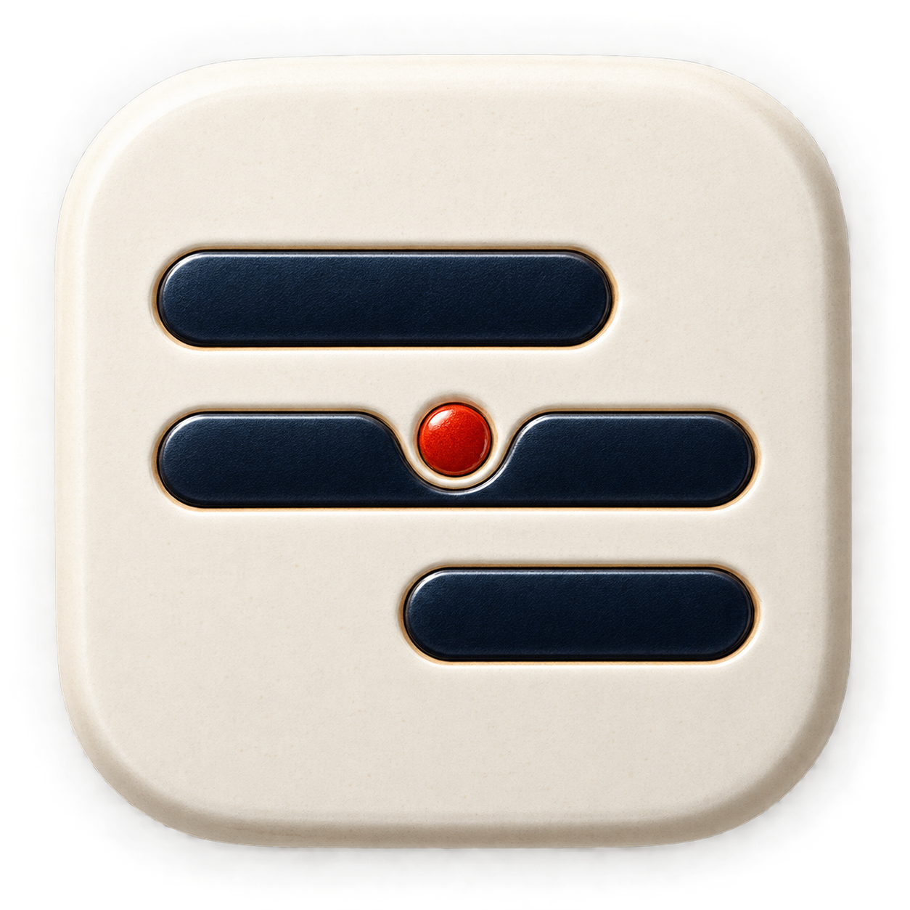

# CountPaper

English · [Chinese](README.md)

CountPaper is a plain-text personal ledger for macOS.

It puts the ledger back in your files: every income, expense, and transfer lives in a readable, durable `.countpaper` text file. CountPaper keeps no private accounting database, needs no account, and never takes over your sync service.



> **Development status:** CountPaper is currently in development and testing. Its interface, file format, and features may change. Do not use a testing build as the only copy of important financial data; enable cloud-provider version history or keep regular backups.

## Why CountPaper

Most ledger apps trap your data inside the app. CountPaper takes a different route: the file is the single source of truth, and the app is simply a more comfortable way to record and understand it.

Keep a ledger in iCloud Drive, Dropbox, Nutstore, or any local folder. Once CountPaper is set as the default app, double-clicking a `.countpaper` file opens it directly. When you want to inspect or edit the source, open that same file in your system-default text editor or an editor chosen in Settings. CountPaper reloads external saves.

## Core experience

- Record-first design: the home screen focuses on the current month's totals, quick entry, and recent activity.
- Balance is maintained automatically: record an expense, income, or transfer; the app maintains the text structure underneath.
- Everyday language in the interface: categories, payment or receiving accounts, and amounts are shown; accounting structure remains in the source text.
- Check on open: an optional balance check reports the date, description, difference, and source location of unbalanced transactions.
- Fast dates: choose Today or Yesterday with one click; use the native calendar for every other date.
- Batch amounts: optionally enter `32 57` to create two similar transactions; negative values support reversals and refunds.
- Text is the data: accounts, transactions, tags, payees, and notes all remain in the `.countpaper` file and can be read by any text tool.
- Find and revise: search historical entries by date, amount, description, payee, account, or tag; then edit or delete them.
- Clear views: journal, reconciliation, accounts, trends, categories, and tag reports are calculated directly from the active file.
- Local-first: no account system, proprietary cloud sync, or private ledger database.

## A ledger file

```text
---
format: countpaper/0.2
currency: CNY
---

@accounts
- Assets:Cash
- Assets:Bank
- Equity:BalanceAdjustment
- Income:Salary
- Expenses:Dining

# 2026-08-12
- Lunch
  - time: 12:35
  - Expenses:Dining  32.50
  - Assets:Cash  -32.50
```

The file stays ordinary, readable text while CountPaper can validate, search, and report on it. See the complete [CountPaper plain-text format 0.2](CountPaper/FORMAT-0.2.md).

## How to use it

1. Open CountPaper, choose **New**, and save the `.countpaper` file where you want it backed up or synced.
2. On the home screen, choose Expense, Income, or Transfer, then record an amount and the relevant accounts.
3. Use **Today** or **Yesterday** for quick entry; choose earlier dates from the calendar.
4. Use the sidebar for the journal, reconciliation, accounts, and reports. Use **More…** on the home screen to find and manage older entries.
5. When you need the raw file, choose **Edit Text** to open it in your preferred external text editor.

## System requirements

The current development build targets:

- A Mac with Apple silicon (M-series, `arm64`).
- macOS Sonoma 14.0 or later.
- No additional memory or storage requirement beyond running macOS normally. Ledgers are ordinary small text files.
- No network connection for normal use. Any sync connection is provided by your chosen file service.

This is a local development build, not yet a signed, notarized, or Mac App Store release. Intel Macs are not currently included in the supported build and test matrix.

## Current scope

CountPaper focuses on daily personal accounting: accounts, income, expenses, transfers, balances, and multidimensional reports.

It does not currently include investments, prices, holdings, net worth, multiple currencies, imports, OCR, attachments, collaboration, proprietary sync, or user accounts.

## Development and verification

CountPaper is built with native Swift and AppKit. You do not need Xcode to use it; full Xcode is only required to build or contribute.

Development requires an Apple-silicon Mac running macOS 14.0 or later, plus Xcode and its Swift toolchain. From the repository root:

```sh
zsh CountPaper/verify.sh
```

This runs parser tests, creates `CountPaper/build/CountPaper.app`, and verifies the local signature.

## Data ownership

Your ledger remains your own file. Use cloud-provider version history or ordinary backups to protect it.

This repository currently has no open-source license. All rights are reserved unless explicitly granted otherwise.
