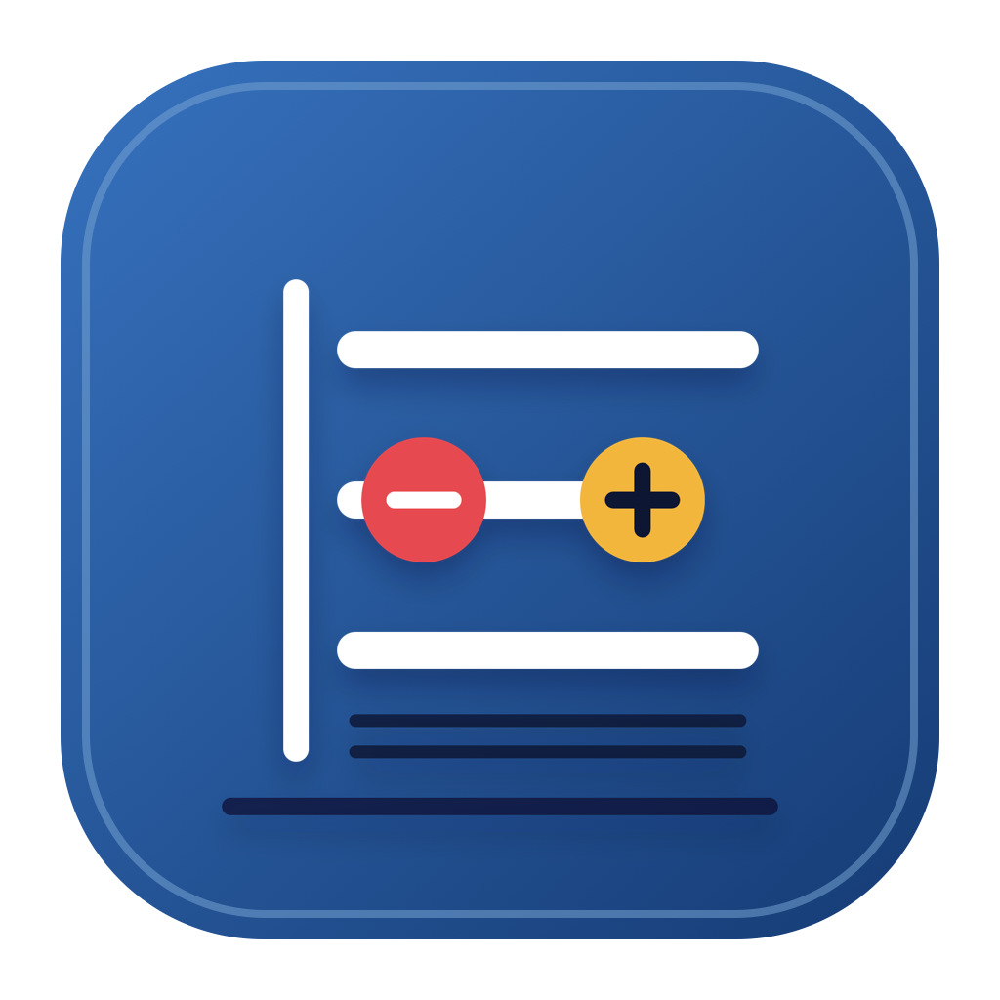

# CountPaper

简体中文

<details>
<summary><strong>English</strong> — click to read without leaving this page</summary>

<br>

CountPaper is a plain-text personal ledger for macOS.

It puts the ledger back in your files: every income, expense, and transfer lives in a readable, durable `.countpaper` text file. CountPaper keeps no private accounting database, needs no account, and never takes over your sync service.

> **Development status:** CountPaper is currently in development and testing. Its interface, file format, and features may change. Do not use a testing build as the only copy of important financial data; enable cloud-provider version history or keep regular backups.

## Why CountPaper

Most ledger apps trap your data inside the app. CountPaper takes a different route: the file is the single source of truth, and the app is simply a more comfortable way to record and understand it.

Keep a ledger in iCloud Drive, Dropbox, Nutstore, or any local folder. Once CountPaper is set as the default app, double-clicking a `.countpaper` file opens it directly. When you want to inspect or edit the source, open that same file in your system-default text editor or an editor chosen in Settings. CountPaper reloads external saves.

## Core experience

- Record-first design: the home screen focuses on the current month's totals, quick entry, and recent activity.
- Balance is maintained automatically: record an expense, income, or transfer; the app maintains the text structure underneath.
- Everyday language in the interface: categories, payment or receiving accounts, and amounts are shown; accounting structure remains in the source text.
- Check on open: an optional balance check reports the date, description, difference, and source location of unbalanced transactions.
- Fast dates: choose Today or Yesterday with one click; use the native calendar for every other date.
- Batch amounts: optionally enter `32 57` to create two similar transactions; negative values support reversals and refunds.
- Text is the data: accounts, transactions, tags, payees, and notes all remain in the `.countpaper` file and can be read by any text tool.
- Find and revise: search historical entries by date, amount, description, payee, account, or tag; then edit or delete them.
- Clear views: journal, reconciliation, accounts, trends, categories, and tag reports are calculated directly from the active file.
- Local-first: no account system, proprietary cloud sync, or private ledger database.

## A ledger file

```text
---
format: countpaper/0.2
currency: CNY
---

@账户
- 资产:现金
- 资产:银行卡
- 收入:工资
- 费用:餐饮

# 2026-08-12
- Lunch
  - time: 12:35
  - 费用:餐饮  32.50
  - 资产:现金  -32.50
```

The file stays ordinary, readable text while CountPaper can validate, search, and report on it. See the complete [CountPaper plain-text format 0.2](CountPaper/FORMAT-0.2.md).

## How to use it

1. Open CountPaper, choose **New**, and save the `.countpaper` file where you want it backed up or synced.
2. On the home screen, choose Expense, Income, or Transfer, then record an amount and the relevant accounts.
3. Use **Today** or **Yesterday** for quick entry; choose earlier dates from the calendar.
4. Use the sidebar for the journal, reconciliation, accounts, and reports. Use **More…** on the home screen to find and manage older entries.
5. When you need the raw file, choose **Edit Text** to open it in your preferred external text editor.

## System requirements

- A Mac with Apple silicon (M-series, `arm64`).
- macOS Sonoma 14.0 or later.
- No additional memory or storage requirement beyond running macOS normally. Ledgers are ordinary small text files.
- No network connection for normal use. Any sync connection is provided by your chosen file service.

This is a local development build, not yet a signed, notarized, or Mac App Store release. Intel Macs are not currently included in the supported build and test matrix.

## Current scope

CountPaper focuses on daily personal accounting: Chinese accounts, income, expenses, transfers, balances, and multidimensional reports.

It does not currently include investments, prices, holdings, net worth, multiple currencies, imports, OCR, attachments, collaboration, proprietary sync, or user accounts.

## Development and verification

CountPaper is built with native Swift and AppKit. You do not need Xcode to use it; full Xcode is only required to build or contribute.

Development requires an Apple-silicon Mac running macOS 14.0 or later, plus Xcode and its Swift toolchain. From the repository root:

```sh
zsh CountPaper/verify.sh
```

This runs parser tests, creates `CountPaper/build/CountPaper.app`, and verifies the local signature.

## Data ownership

Your ledger remains your own file. Use cloud-provider version history or ordinary backups to protect it.

This repository currently has no open-source license. All rights are reserved unless explicitly granted otherwise.

</details>

CountPaper 是一款为 macOS 设计的纯文本个人账本。

它把账本还给文件：每一笔收入、支出和转账都保存在一个可读、可长期保存的 `.countpaper` 文本文件中。CountPaper 不建立私有账务数据库，不需要账户，也不接管你的同步服务。



> **开发状态：** CountPaper 目前处于开发测试阶段，界面、文本格式和功能仍可能调整。请勿把测试版本作为账务数据的唯一副本，建议始终启用云盘版本历史或定期备份。

## 为什么是 CountPaper

记账软件通常让数据困在应用里。CountPaper 选择另一条路：文件是唯一真实数据，App 只是一个更适合记账的界面。

你可以把账本放在 iCloud Drive、Dropbox、坚果云或任意本地文件夹；将 CountPaper 设为默认打开 App 后，双击 `.countpaper` 文件即可直接进入账本。需要阅读或修改原始文本时，CountPaper 也可以将同一个文件交给系统默认的文本编辑器，或你在设置中选择的 App。外部保存后，CountPaper 会重新读取文件。

## 核心体验

- 记账优先：首页围绕本月收支、快速录入和最近交易设计。
- 自动保持平衡：用户只需记录支出、收入或转账，底层文本结构由 App 自动维护。
- 界面使用日常语言：只呈现分类、收付款账户和金额；复式结构仅保留在原始文本中。
- 打开即检查：可在设置中开启或关闭余额检查；发现不平衡交易时会提示日期、摘要、差额和文本位置。
- 快捷日期：今天、昨天一键选择；其他日期使用原生日历。
- 批量金额：可选地输入 `32 57`，一次写入两笔同类交易；负数可用于退款和冲减。
- 文本即数据：账户、交易、标签、收款方和备注都在 `.countpaper` 文件内，可用任何文本工具查看。
- 查找与修订：可按日期、金额、摘要、收款方、账户和标签检索历史交易，并进行修改或删除。
- 一眼看懂：日记账、逐笔对账、账户、趋势、分类和标签报表全部由当前文件即时计算。
- 可追溯：新交易记录精确到分钟；“对账”会展示每笔交易发生后的全部资产与负债余额。
- 本地优先：没有账户系统、没有自建云同步、没有私有账务数据库。

## 一个账本文件

```text
---
format: countpaper/0.2
currency: CNY
---

@账户
- 资产:现金
- 资产:银行卡
- 收入:工资
- 费用:餐饮

# 2026-08-12
- 午餐
  - 时间: 12:35
  - 费用:餐饮  32.50
  - 资产:现金  -32.50
```

这是一笔完整的支出：费用增加 32.50，现金减少 32.50。文件保持普通文本的可读性，同时能被 CountPaper 校验、搜索和统计。

完整格式说明见 [CountPaper 纯文本格式 0.2](CountPaper/FORMAT-0.2.md)。

## 使用方式

1. 打开 CountPaper，选择“新建”，并把 `.countpaper` 文件保存到你希望同步或备份的位置。
2. 在首页选择支出、收入或转账，填写金额和账户后记入账本。
3. 使用“今天”或“昨天”快速记账；更早的交易可从日历选择日期。
4. 在侧栏查看日记账、逐笔对账、账户和整页报表；使用首页“更多…”查找及管理久远交易。
5. 需要直接阅读或编辑文件时，点击“编辑文本”；文件会在指定的外部文本 App 中打开。

## 运行要求

当前开发测试版本的目标环境：

- Mac：搭载 Apple 芯片的 Mac（M 系列，`arm64`）。
- 系统：macOS Sonoma 14.0 或更高版本。
- 内存与存储：没有额外硬件要求；能正常运行上述系统即可。账本本身是普通文本文件，占用空间很小。
- 网络：日常使用不需要联网。使用 iCloud Drive、Dropbox、坚果云等同步时，网络需求由相应文件服务决定。

目前提供的是本地开发构建，尚未作为正式签名、公证或 Mac App Store 版本发布。Intel Mac 尚未纳入当前构建和测试范围。

## 当前范围

CountPaper 专注个人日常记账：中文账户、收入、支出、转账、基础余额与多维报表。

当前不包含投资、价格、持仓、净值、多币种、导入、OCR、附件、多人协作、自建同步或账户系统。

## 开发与验证

项目使用原生 Swift 和 AppKit。普通使用者不需要安装 Xcode；只有自行构建或参与开发时才需要完整 Xcode。

开发环境需要：

- 搭载 Apple 芯片的 Mac。
- macOS 14.0 或更高版本。
- Xcode，以及随 Xcode 安装的 Swift 编译工具链。

在仓库根目录运行：

```sh
zsh CountPaper/verify.sh
```

该命令会运行解析测试、生成 `CountPaper/build/CountPaper.app` 并检查本地签名。

## 数据归属

你的账本数据始终是你自己的文件。请使用云盘版本历史或常规备份来保护 `.countpaper` 文件。

本仓库暂未附带开源许可证；除非另有明确许可，代码保留所有权利。
