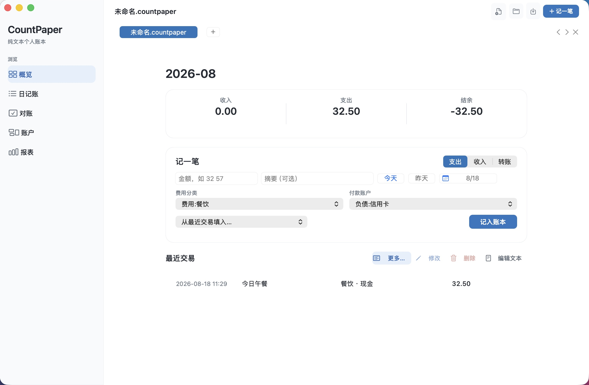

# CountPaper

[English](README.md) · 简体中文

CountPaper 是一款面向 macOS 的本地优先纯文本个人账本。`.countpaper` 文件是唯一真实数据，App 负责录入、校验、浏览与统计。


> **当前版本：** [CountPaper 0.12.0](https://github.com/clancygo/CountPaper/releases/tag/v0.12.0)。项目仍处于开发测试阶段，请为重要账本保留常规备份或云盘版本历史。

## 下载

下载 [CountPaper-0.12.0.dmg](https://github.com/clancygo/CountPaper/releases/download/v0.12.0/CountPaper-0.12.0.dmg)，打开后将 CountPaper 拖入“应用程序”。

当前版本是本地签名的开发构建，尚未公证。首次打开时，macOS 可能显示安全提示。

## 界面一览

<p align="center">
  
</p>

## 为什么是 CountPaper

- **文件归你所有。** 没有私有账务数据库、账户系统或自建云同步。
- **纯文本，不锁定数据。** 可用任何文本编辑器阅读或修改同一个文件，CountPaper 会重新读取外部保存。
- **记账优先。** 首页把当月收支、紧凑录入和最近交易放在同一个工作流中。
- **界面简单，文本平衡。** 界面只展示分类、收付款账户和金额，平衡分录完整保留在源文件中。
- **由文件直接计算。** 日记账、对账、账户余额、余额检查、趋势、分类和标签报表都来自当前文件。

## 0.12.0 更新

- 支持添加、修改和安全删除账户，以及设置初始余额和余额调整。
- 对账改为紧凑、可正倒序切换的单行列表，显示每笔交易后的余额。
- 重设计记账日期选择器，清楚显示选中日期，并提供今天、昨天和原生日历。
- 重整 macOS 工作区：导航分组、账本上下文和更宽的记账主区。

## 一个账本文件

```text
---
format: countpaper/0.2
currency: CNY
---

@账户
- 资产:现金
- 资产:银行卡
- 权益:余额调整
- 收入:工资
- 费用:餐饮

# 2026-08-12
- 午餐
  - 时间: 12:35
  - 费用:餐饮  32.50
  - 资产:现金  -32.50
```

完整格式说明见 [CountPaper 纯文本格式 0.2](CountPaper/FORMAT-0.2.md)。

## 运行要求

- 搭载 Apple 芯片的 Mac（M 系列，`arm64`）
- macOS Sonoma 14.0 或更高版本
- 日常使用不需要联网。iCloud Drive、Dropbox、坚果云等文件服务负责你选择的同步。

目前未将 Intel Mac 纳入构建与测试范围。

## 开发

CountPaper 使用原生 Swift 和 AppKit。构建并验证：

```sh
zsh CountPaper/verify.sh
```

生成按版本命名的 DMG：

```sh
zsh CountPaper/build-dmg.sh
```

本仓库暂未附带开源许可证。除非另有明确许可，代码保留所有权利。
